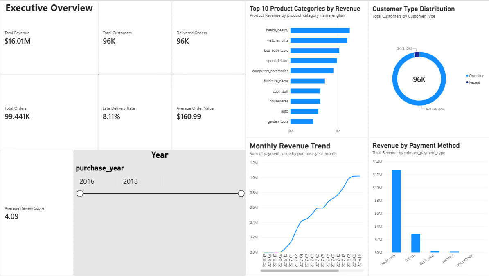
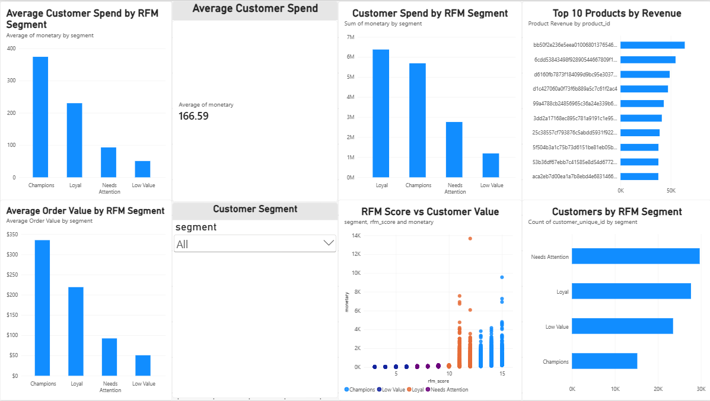
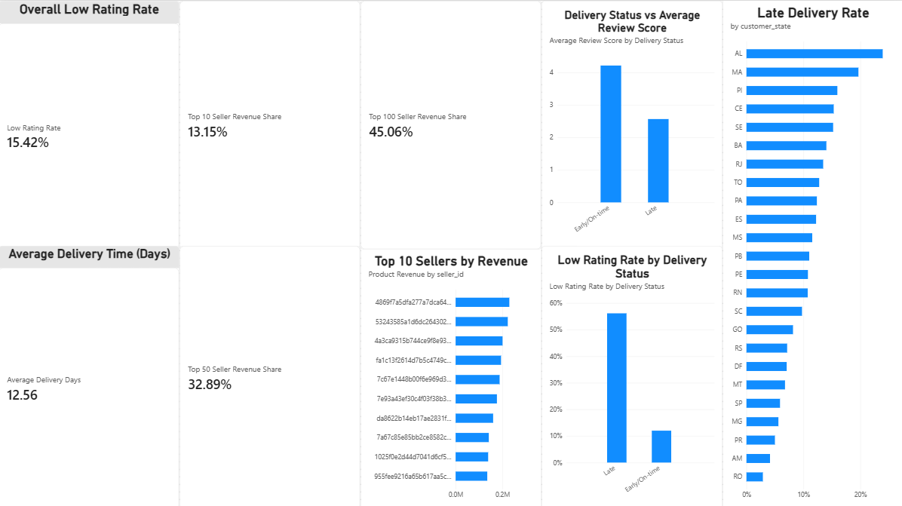

# 🛒 E-Commerce Sales & Customer Analytics

An end-to-end data analytics project using the Brazilian E-Commerce Public Dataset by Olist to analyze sales performance, customer behavior, product performance, delivery operations, payments, and customer reviews.

## 📌 Project Overview

This project analyzes an e-commerce business from multiple perspectives to identify trends, operational issues, and opportunities for improving revenue and customer experience.

The analysis combines **SQL, Python, and Power BI** to transform raw transactional data into meaningful business insights.

### Business Questions

* How is revenue changing over time?
* Which product categories generate the most revenue?
* Which sellers and products perform best?
* What are the most common payment methods?
* How does delivery time affect customer satisfaction?
* Which states and regions generate the most orders?
* What factors are associated with poor customer reviews?
* What are the key opportunities for improving e-commerce performance?

## 📊 Dataset

The project uses the **Brazilian E-Commerce Public Dataset by Olist**.

The dataset contains multiple interconnected tables covering:

* Customers
* Orders
* Order Items
* Order Payments
* Order Reviews
* Products
* Sellers
* Geolocation
* Product Category Translation

These tables are connected using identifiers such as customer ID, order ID, product ID, seller ID, and geographic information.

## 🛠️ Tools & Technologies

| Tool         | Purpose                                                      |
| ------------ | ------------------------------------------------------------ |
| SQL          | Data querying, joins, aggregations and business analysis     |
| Python       | Data cleaning, exploratory analysis and statistical analysis |
| Pandas       | Data manipulation and transformation                         |
| NumPy        | Numerical analysis                                           |
| Matplotlib   | Data visualization                                           |
| Seaborn      | Exploratory visualizations                                   |
| Power BI     | Interactive dashboard and KPI reporting                      |
| Git & GitHub | Version control and project documentation                    |

## 🔄 Project Workflow

```text
Raw Data
   ↓
Data Understanding
   ↓
Data Cleaning & Preparation
   ↓
SQL Analysis
   ↓
Python Exploratory Data Analysis
   ↓
Business Insights
   ↓
Power BI Dashboard
   ↓
Recommendations
```

## 📁 Project Structure

```text
E_Commerce_Analytics/
│
├── assets/
│
├── data/
│   └── raw/
│       └── Olist datasets
│
├── docs/
│   └── Project documentation
│
├── Powerbi/
│   └── Power BI dashboard files
│
├── Python/
│   └── Python analysis and notebooks
│
├── screenshots/
│   └── Dashboard and analysis screenshots
│
├── SQL/
│   └── SQL queries and business analysis
│
├── .gitignore
└── README.md
```

## 🔍 Analysis Areas

### 1. Sales Performance

Analysis of:

* Total orders
* Total revenue
* Average order value
* Monthly and yearly sales trends
* Revenue by product category
* Revenue by geographic region

### 2. Customer Analysis

Analysis of:

* Customer distribution
* Repeat purchasing behavior
* Customer locations
* Order frequency
* Customer spending patterns

### 3. Product & Seller Analysis

Analysis of:

* Top-performing product categories
* Best-selling products
* Seller performance
* Order volume
* Revenue contribution

### 4. Delivery & Operations

Analysis of:

* Estimated vs actual delivery time
* Delivery delays
* Delivery performance by region
* Relationship between delivery performance and reviews

### 5. Customer Satisfaction

Analysis of:

* Review scores
* Review distribution
* Low-rated orders
* Relationship between delivery experience and customer satisfaction

### 6. Payment Analysis

Analysis of:

* Payment methods
* Installment patterns
* Payment values
* Payment behavior across orders

## 📈 Power BI Dashboard

The Power BI dashboard contains three interactive pages designed for different business perspectives.

### 1. Executive Overview

Provides a high-level view of overall business performance.

**KPIs:**
- Total Revenue
- Total Customers
- Delivered Orders
- Total Orders
- Average Order Value
- Late Delivery Rate
- Average Review Score

**Analysis:**
- Monthly Revenue Trend
- Top 10 Product Categories by Revenue
- Revenue by Payment Method
- Customer Type Distribution
- Year-based filtering

### 2. Customer & Product Intelligence

Focuses on customer segmentation, customer value, and product performance.

**Analysis:**
- Average Customer Spend by RFM Segment
- Average Customer Spend
- Customer Spend by RFM Segment
- Average Order Value by RFM Segment
- Customers by RFM Segment
- Top 10 Products by Revenue
- RFM Score vs Customer Value
- Customer Segment filtering

### 3. Operations & Seller Performance

Focuses on delivery operations, customer satisfaction, and seller performance.

**Analysis:**
- Overall Low Rating Rate
- Average Delivery Time (Days)
- Late Delivery Rate by State
- Delivery Status vs Average Review Score
- Low Rating Rate by Delivery Status
- Top 10 Sellers by Revenue
- Top 10 Seller Revenue Share
- Top 50 Seller Revenue Share
- Top 100 Seller Revenue Share

## 📸 Dashboard Preview

### 1. Executive Overview



### 2. Customer & Product Intelligence



### 3. Operations & Seller Performance



## 🧮 SQL Analysis

SQL is used to perform:

* Multi-table joins
* Aggregations
* Subqueries
* CTEs
* Window functions
* Date-based analysis
* Ranking
* Customer and seller analysis
* Business KPI calculations

The SQL analysis focuses on answering practical business questions rather than simply demonstrating SQL syntax.

## 🐍 Python Analysis

Python is used for:

* Data loading
* Data cleaning
* Missing-value analysis
* Data transformation
* Exploratory Data Analysis
* Statistical summaries
* Trend analysis
* Visualization
* Business insight generation

## 💡 Key Business Insights

### Revenue & Orders

- Total revenue is approximately **$16.01M**.
- The dataset contains approximately **99.44K orders**.
- Average order value is approximately **$160.99**.

### Customer Behavior

- The dataset contains approximately **96K customers**.
- RFM segmentation identifies distinct customer groups with different purchasing behavior and value.
- Customer segmentation can support targeted retention and re-engagement strategies.

### Delivery & Customer Satisfaction

- Approximately **8.11%** of orders are classified as late.
- Average delivery time is approximately **12.56 days**.
- Late deliveries are associated with substantially lower customer review scores.
- Delivery performance is therefore an important component of customer satisfaction.

### Seller Performance

- The top 10 sellers contribute approximately **13.15%** of revenue.
- The top 50 sellers contribute approximately **32.89%** of revenue.
- The top 100 sellers contribute approximately **45.06%** of revenue.

## 🎯 Key Skills Demonstrated

**SQL • PostgreSQL • Python • Pandas • NumPy • Matplotlib • Seaborn • Power BI • DAX • Data Cleaning • Exploratory Data Analysis • Business Intelligence • KPI Analysis • RFM Analysis • Data Visualization • Git • GitHub**

## 🚀 Project Goal

The objective of this project is to simulate a real-world **Data Analyst workflow**, starting from raw transactional data and progressing through:

**Data Preparation → SQL Analysis → Python EDA → Business Intelligence → Power BI Dashboard → Business Recommendations**

The project demonstrates practical skills in working with relational e-commerce data, performing business-focused analysis, building interactive dashboards, and communicating analytical findings through actionable insights.

This project is part of my portfolio as I prepare for opportunities in **Data Analytics and Business Intelligence**.

---

## ⭐ Project Status

**Completed**

- ✅ Data preparation
- ✅ PostgreSQL database analysis
- ✅ SQL business analysis
- ✅ Python exploratory analysis
- ✅ RFM customer segmentation
- ✅ Business KPI development
- ✅ Power BI dashboard
- ✅ Business insights
- ✅ Business recommendations
- ✅ Project documentation

## 👤 Author

**Pranav Ratnaparkhi**

B.Tech — Artificial Intelligence & Data Science

Interested in **Data Analytics, Business Intelligence, SQL, Python, and Data Visualization**.

🔗 GitHub: https://github.com/Pranav21-95

🔗 LinkedIn: https://www.linkedin.com/in/pranav-ratnaparkhi-470829330/
